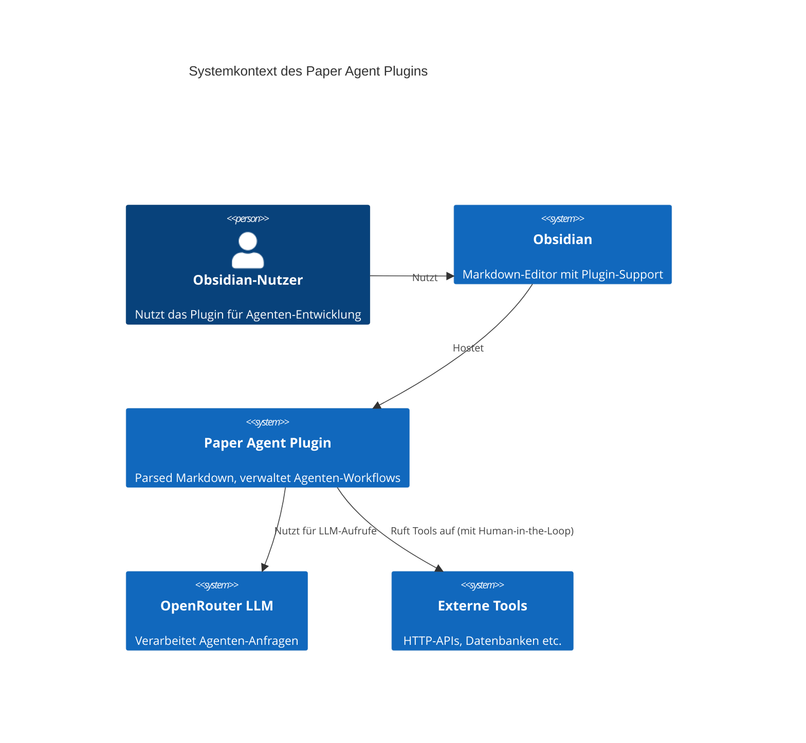

### **1. Einführung und Ziele**

---

#### **1.1 Aufgabenstellung**

**Kurzbeschreibung:**
Das Projekt **"Paper Agent"** ist ein **Obsidian-Plugin**, das die Entwicklung, Dokumentation und das Testen von **LLM-basierten Agenten** in einer **Markdown-umgebung** ermöglicht. Ziel ist es, Agenten **frameworkunabhängig**, **transparent** und **modular** zu definieren, zu evaluieren und zu prototypisieren – ohne komplexe Tools oder Runtimes. Die Agenten werden in **Markdown-Dateien** beschrieben, die als **technische Spezifikation**, **Dokumentation** und **Ausführungsgrundlage** dienen.

**Fachliche Aufgabenstellung:**
- **Agenten-Design:** Definition von Agenten in **reinem Markdown** (Prompts, Tools, Memory, Reasoning, Planning).
- **Prototyping:** Schnelle Iteration und Evaluation von Agenten-Workflows **ohne Overhead**.
- **Integration:** Nutzung von **Obsidian-nativen Funktionen** (z. B. Audioaufnahmen) und **OpenRouter** für die LLM-Anbindung.
- **Sicherheit:** **Human-in-the-Loop**-Bestätigung für kritische Operationen (z. B. Dateischreibzugriffe, REST-PUT/POST).
- **Portabilität:** Agenten-Definitionen als **reine Textdateien**, die überall ausgeführt werden können, wo eine einfache Runtime verfügbar ist.

**Zusammenfassung der Anforderungen:**
| Anforderung                     | Beschreibung                                                                                     |
|----------------------------------|-------------------------------------------------------------------------------------------------|
| **Frameworkunabhängigkeit**      | Keine Abhängigkeit von LangChain, AutoGen etc.                                                  |
| **Transparenz**                  | Alle Agenten-Eigenschaften in **lesbaren Markdown-Dateien** definiert.                          |
| **Modularität**                  | Aufteilung in mehrere Markdown-Dateien für komplexe Agenten.                                    |
| **Sicherheit**                   | **Sandbox-Umgebung** für JavaScript (QuickJS für Obsidian Mobile), **Human-in-the-Loop** für kritische Aktionen. |
| **Prototyping-Fokus**            | Ziel ist **Lernen und Evaluieren**, nicht produktiver Einsatz.                                  |
| **Integration mit Obsidian**     | Nutzung von **nativen Audioaufnahmen** und **Markdown-Links** für Chat-Historie.                |
| **Tool-Chaining**                | Definition von **HTTP-Requests** mit Pre-/Postprocessing in JavaScript.                        |

---

#### **1.2 Qualitätsziele**

**Top-3 Qualitätsziele (nach ISO 25010):**

| Qualitätsziel          | Szenario                                                                                     | Priorität |
|------------------------|----------------------------------------------------------------------------------------------|-----------|
| **Wartbarkeit**        | Agenten-Definitionen müssen **einfach anpassbar** sein, ohne Runtime-Änderungen.             | Hoch      |
| **Portabilität**       | Agenten-Definitionen als **Textdateien** müssen in jeder Umgebung ausführbar sein.           | Hoch      |
| **Sicherheit**         | **Keine unbeabsichtigten Datei- oder API-Änderungen** durch Human-in-the-Loop-Bestätigung.    | Hoch      |
| **Benutzerfreundlichkeit** | Entwickler müssen **ohne Schulung** Agenten in Markdown definieren und testen können.        | Mittel    |
| **Performance**        | **Schnelle Iteration** durch minimale Abhängigkeiten und einfache Runtime.                   | Mittel    |

---

#### **1.3 Stakeholder**

**Übersicht der Stakeholder:**

| Rolle                     | Kontakt               | Erwartungshaltung                                                                                     |
|---------------------------|-----------------------|-------------------------------------------------------------------------------------------------------|
| **Entwickler (Merlin Becker)** | merlin@becker.dev     | **Schnelles Prototyping**, klare Dokumentation, **kein Overengineering**.                            |
| **Obsidian-Nutzer**       | community@obsidian.md | **Einfache Integration** in Obsidian, **keine komplexe Einrichtung**.                                 |
| **LLM-Entwickler**        | llm-team@openrouter   | **Klar definierte Schnittstellen** für LLM-Aufrufe.                                                   |
| **Sicherheitsverantwortliche** | security@becker.dev   | **Keine unsicheren Skriptausführungen**, klare Sandbox-Grenzen.                                       |

---

#### **1.4 Visualisierung: Systemkontext (C4-Diagramm)**

**Erläuterung:**
- Der **Nutzer** interagiert mit **Obsidian**, das das **Paper Agent Plugin** hostet.
- Das Plugin **parst Markdown-Dateien**, verwaltet Agenten-Workflows und **kommuniziert mit OpenRouter** für LLM-Aufrufe.
- **Externe Tools** (z. B. REST-APIs) werden nur nach **Bestätigung** aufgerufen.

---

#### **1.5 Zusammenfassung der Motivation**
- **Lernziel:** Tiefes Verständnis für **Agenten-Design** durch manuelle Definition und Evaluation.
- **Pragmatismus:** **Kein Overengineering**, Fokus auf **Kernfunktionalität** (Markdown, Sicherheit, Portabilität).
- **Zielgruppe:** **Entwickler**, die Agenten **ohne Framework-Zwang** prototypisieren möchten.

---
**Frage an dich:**
- Soll der Fokus auf **technische Details** (z. B. Sandbox-Implementierung) vertieft werden?
- Oder sollen **konkrete Beispiele** für Agenten-Definitionen (Markdown-Snippets) ergänzt werden?