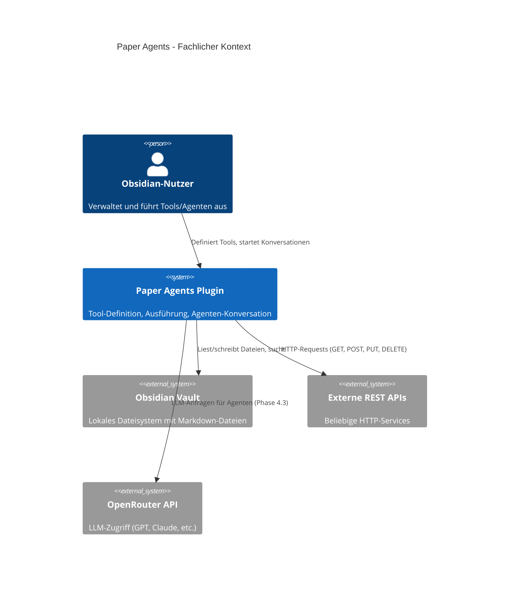

# 3. Kontextabgrenzung

## 3.1 Fachlicher Kontext

### Schnittstellen

| Schnittstelle | Beschreibung |
|---------------|--------------|
| **Obsidian-Nutzer** | Interagiert über Sidebar, Formulare, Commands und Markdown-Dateien |
| **Obsidian Vault** | Dateisystem-Zugriff via Obsidian Vault-API (`search_files`, `read_file`, `write_file`) |
| **Externe REST APIs** | HTTP-Requests via `rest_request`-Tool (GET, POST, PUT, DELETE) |
| **OpenRouter API** | LLM-Kommunikation für Agenten-Konversationen (Phase 4.3, ausstehend) |

## 3.2 Technischer Kontext

| Kanal/Schnittstelle | Technologie | Protokoll |
|---------------------|-------------|-----------|
| Plugin → Obsidian | Obsidian Plugin-API (TypeScript) | In-Process-API |
| Plugin → Vault | `app.vault.*` Methoden | Lokales Dateisystem |
| Plugin → REST APIs | `fetch()` / `requestUrl()` | HTTP/HTTPS |
| Plugin → OpenRouter | HTTP POST mit Bearer Token | HTTPS + SSE (Streaming) |
| Plugin → QuickJS | `quickjs-emscripten` WASM | In-Memory, JSON-Serialisierung |
| Build → Bundle | esbuild | TypeScript → CommonJS `main.js` |
| Test → Runner | Vitest + @vitest/coverage-v8 | Node.js |

---

**Zurück:** [Randbedingungen ←](02-randbedingungen.md) | **Weiter:** [Lösungsstrategie →](04-loesungsstrategie.md)
