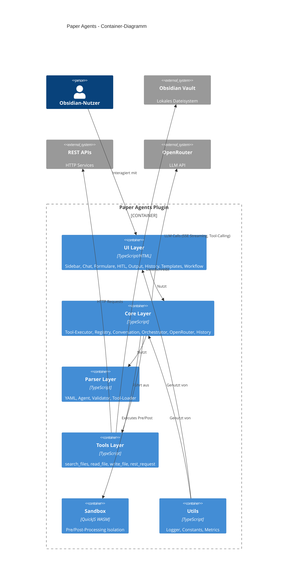

# 5. Bausteinsicht

## 5.1 Whitebox Gesamtsystem (Ebene 1)



### Bausteine (Blackboxen)

#### Plugin Entry Point (`main.ts`)

- **Verantwortung**: Plugin-Lifecycle (onload/onunload), Settings, Initialisierung aller Subsysteme (Orchestrator, ToolRegistry, History, Persistence, Chat). Delegiert Command-Registrierung an `commands/index.ts`.
- **Schnittstellen**: Obsidian Plugin-API, alle internen Module
- **Datei**: `src/main.ts` (~360 Zeilen)

#### Commands Module (`commands/index.ts`)

- **Verantwortung**: Registrierung aller Plugin-Commands, extrahiert aus main.ts
- **Datei**: `src/commands/index.ts` (~120 Zeilen)
- **Commands**: open-sidebar, open-chat, reload-custom-tools, reload-agents, show-history, browse-templates, show-workflow, apply-agent-canvas

#### UI Layer

- **Verantwortung**: Benutzerinteraktion, Tool-Übersicht, Chat, Formular-Eingabe, Bestätigungsdialoge, History, Templates, Workflow-Visualisierung, Agent Canvas
- **Dateien**: `src/ui/sidebar.ts`, `src/ui/chat.ts`, `src/ui/forms.ts`, `src/ui/hitl-modal.ts`, `src/ui/output-panel.ts`, `src/ui/history-panel.ts`, `src/ui/template-browser.ts`, `src/ui/workflow-view.ts`, `src/ui/canvas-modal.ts`
- **Schnittstellen**: Obsidian UI-API (View, Modal, Setting), ToolRegistry, ToolExecutor, Orchestrator, ExecutionHistory

#### Core Execution Layer

- **Verantwortung**: Tool-Ausführung, Tool-Verwaltung, Konversations-State, LLM-Orchestrierung, API-Kommunikation, Execution History, Markdown-Persistierung von Conversations, Agent-Canvas-Dokumentoperationen
- **Dateien**: `src/core/tool-executor.ts`, `src/core/tool-registry.ts`, `src/core/conversation.ts`, `src/core/conversation-file-manager.ts`, `src/core/sandbox.ts`, `src/core/openrouter.ts`, `src/core/orchestrator.ts`, `src/core/history.ts`, `src/core/persistence.ts`, `src/core/canvas-agent.ts`
- **Schnittstellen**: Parser-Layer (Eingabe), Tools-Layer (Ausführung), UI-Layer (Ergebnisse), OpenRouter API (LLM)

#### Parser & Validation Layer

- **Verantwortung**: Markdown/YAML-Parsing, Parametervalidierung, Placeholder-Auflösung, Tool-Discovery, Wikilink-Auflösung
- **Dateien**: `src/parser/yaml-parser.ts`, `src/parser/validator.ts`, `src/parser/placeholder.ts`, `src/parser/tool-loader.ts`, `src/parser/agent-parser.ts`, `src/parser/wikilink-resolver.ts`
- **Schnittstellen**: Vault (Markdown-Dateien), Core-Layer (geparste Definitionen)

#### Tools Layer

- **Verantwortung**: Implementierung der 4 vordefinierten Tools
- **Datei**: `src/tools/predefined.ts`
- **Schnittstellen**: Obsidian Vault-API, HTTP-fetch, ToolRegistry

#### Utils Layer

- **Verantwortung**: Shared Constants, Logging, Execution-Metriken, Tracing
- **Dateien**: `src/utils/constants.ts`, `src/utils/logger.ts`, `src/utils/metrics.ts`
- **Schnittstellen**: Von allen anderen Layern genutzt

## 5.2 Ebene 2 – Core Execution Layer

### Tool-Executor (`tool-executor.ts`)

**3-Phasen-Execution-Pipeline:**

```javascript
Input-Parameter
      ↓
┌─────────────────┐
│ Phase 1: Pre    │  Optional: JavaScript-Transformation in Sandbox
│ Processing      │  Input → modifizierter Input
└────────┬────────┘
         ↓
┌─────────────────┐
│ Phase 2: Tool   │  Ausführung des referenzierten Tools
│ Execution       │  (Single oder Chain)
└────────┬────────┘
         ↓
┌─────────────────┐
│ Phase 3: Post   │  Optional: JavaScript-Transformation in Sandbox
│ Processing      │  Output → modifizierter Output
└────────┬────────┘
         ↓
    Final Result
```

- **Single Execution**: Ein Tool mit optionalem Pre-/Post-Processing
- **Chain Execution**: Mehrere Steps sequenziell, mit State-Sharing via Placeholder (`{{prev_step.output}}`)
- **HITL-Integration**: Prüft `shouldRequireHITL()` vor Ausführung, ruft HITL-Modal auf
- **Coverage**: 89.06%

### Tool-Registry (`tool-registry.ts`)

- **Factory Pattern** für Tool-Erstellung und -Registrierung
- Methoden: `registerTool()`, `getTool()`, `hasTool()`, `listTools()`
- Unterscheidung: `predefined` vs. `custom` vs. `chain`
- **Coverage**: 77.38%

### ConversationManager (`conversation.ts`)

- **State-Management** für Agenten-Konversationen
- Methoden: `createConversation()`, `addMessage()`, `getMessagesForContext()`, `buildContext()`
- **Markdown-Serialisierung**: `toConversationFile()`, `loadFromConversationFile()`, `parseConversationFile()` – round-trip-fähig mit ISO 8601 Timestamps
- **Token-Counting**: Approximativ (4 Zeichen ≈ 1 Token)
- **Memory-Strategien**: `conversation` (letzte N Nachrichten), `summary` (Zusammenfassung), `none`
- **LLM-Formatierung**: `formatMessagesForLLM()` für OpenRouter-API
- **Coverage**: 97.47%

### ConversationFileManager (`conversation-file-manager.ts`)

- **Markdown-Persistenz** für einzelne Conversation-Dateien im Vault
- Konstruktor akzeptiert eine `ConversationManager`-Instanz (kein globaler Singleton)
- `saveConversation(filePath, conversationId)`: Schreibt Conversation als Markdown-Datei (erstellt oder überschreibt)
- `loadConversation(filePath)`: Liest Conversation aus Markdown-Datei und registriert sie im Manager
- `createConversationFile(conversationId, conversationsPath, title?)`: Legt initiale Markdown-Datei für eine bestehende Conversation an
- `isConversationFile(filePath)`: Prüft `conversation: true` Frontmatter
- `listConversationFiles(folderPath)`: Gibt alle `.md`-Dateien im Ordner als `{ path, title }` zurück (alphabetisch sortiert)
- **Speicherformat**: YAML-Frontmatter (id, agentId, createdAt, updatedAt) + `### Role (timestamp)` Nachrichtenblöcke

### Orchestrator (`orchestrator.ts`)

- **LLM-Chat-Orchestrierung** mit OpenRouter SSE-Streaming
- Multi-Round Tool-Calling (max. 10 Runden pro Nachricht)
- Callback-basiertes Streaming an UI: `onToken`, `onToolCallStart`, `onToolCallEnd`, `onComplete`, `onError`
- Konvertiert Agenten-Definitionen zu OpenRouter Tool-Schemas
- Integration mit `globalMetrics`/`globalLogger` für Tracing und Metriken
- **Agentic Loop**: `runAgenticLoop()` iteriert eigenständig bis zur Terminierungsbedingung (max. `maxIterations`); `augmentAgentForLoop()` injiziert `finish_task`- und `ask_user`-Tools und setzt `transforms: ["middle-out"]`; `checkLoopTermination()` prüft alle drei Strategien (`auto`, `phrase`, `tool`); `getAskUserQuestion()` erkennt HITL-Pausen; `AgenticLoopCallbacks` umfasst `onIterationStart`, `onIterationEnd` (async), `onLoopComplete`, `onHITLPause`

### Persistence (`persistence.ts`)

- **Vault-basierte Persistenz-Helpers** für JSON-Daten
- Factory-Funktionen: `createVaultSaver()`, `createVaultLoader()`
- Initialisiert History-Persistenz (`initializeHistoryPersistence`)
- Speicherort: `.obsidian/plugins/paper-agents/`
- Datei: `history.json`

### Sandbox (`sandbox.ts`)

- **QuickJS-Emscripten** WASM-Runtime
- Führt Pre-/Post-Processing-JavaScript isoliert aus
- **Limits**: Memory 10 MB, Timeout 5 s
- **Code-Validierung**: Blockiert `require`, `eval`, `process`, `global`, `Function`
- IIFE-Wrapping für `return`-Statement-Support
- JSON-basierter Datenaustausch (Input/Output)
- **Coverage**: 69.26%

### CanvasAgent (`canvas-agent.ts`)

- **Dokument-Annotation** mit AI-Agenten als Obsidian-Callout-Blöcke
- Methoden: `buildInitialPrompt(content)`, `buildSelectionPrompt(selection)`, `appendAgentCallout(file, agentName, text)`, `appendUserCallout(file, text)`, `removeCallout(file, calloutText)`, `parseInlinePlacement(responseText)`, `insertCalloutAfterParagraph(content, callout, N)`, `extractCanvasCallouts(content)`, `getActiveEditorSelection()`
- Canvas-Callouts werden durch `<!-- paper-agents-canvas -->`-Marker identifiziert
- `appendAgentCallout` / `appendUserCallout` geben den genauen Callout-Text zurück (für spätere Löschung via `removeCallout`)
- **Inline-Platzierung**: Agent-Antworten mit `@after-paragraph-N:` am Anfang werden nach Absatz N eingefügt
- **Multi-Agenten**: Jeder Agent erhält eine eigene Konversation; Callouts werden sequenziell angehängt
- **Coverage**: 94 %+ (53 Unit-Tests)

## 5.3 Ebene 2 – Parser & Validation Layer

### YAML-Parser (`yaml-parser.ts`)

- Extrahiert YAML Frontmatter aus Markdown
- Parst Tool-Metadaten (id, name, type, parameters)
- Extrahiert Code-Blöcke (`// @preprocess`, `// @postprocess`)
- Unterstützt Single- und Chain-Tool-Definitionen
- **Coverage**: 82.38%

### Agent-Parser (`agent-parser.ts`)

- Parst Agenten-Definitionen aus Markdown (Frontmatter `agent: true`)
- Extrahiert System-Prompt und Kontext-Template aus Sections
- Validiert AgentDefinition (required fields, temperature range, token limits)
- Flexible Memory-Keys (camelCase und snake_case)
- **Coverage**: 94.49%

### Validator (`validator.ts`)

- Validiert required/optional Parameter mit Typ-Konvertierung
- Unterstützte Typen: `string`, `number`, `boolean`, `array`, `object`
- Default-Werte, Fehler-Aggregation
- **Coverage**: 62.19%

### Placeholder-Engine (`placeholder.ts`)

- Ersetzt dynamische Platzhalter: `{{date}}`, `{{time}}`, `{{random_id}}`
- Parameter-Zugriff: `{{query}}`, `{{filePath}}`
- Nested Object Access: `{{prev_step.output.results[0].path}}`
- **Coverage**: 85.71%

### Tool-Loader (`tool-loader.ts`)

- Rekursive Discovery von Custom Tools in konfigurierbarem Verzeichnis
- Filtert nach `tool: true` im Frontmatter
- Fehlerbehandlung für invalide Definitionen
- **Coverage**: 69.74%

### WikilinkResolver (`wikilink-resolver.ts`)

- **Ladezeit-Auflösung** von `[[Wikilinks]]` in Agenten- und Tool-Definitionen
- Methode: `resolve(content, sourcePath?): Promise<string>`
- **Pfadauflösung**: primär `MetadataCache.getFirstLinkpathDest()`, Fallback direkte Vault-Pfade
- **Rekursion**: bis zu `maxDepth` (Standard: 3) mit `visited`-Set für Zyklenschutz
- **Einbettungsformat**: Wrapper-Kommentare `<!-- wikilink:pfad -->` / `<!-- /wikilink:pfad -->` für Transparenz
- Nur `.md`-Dateien werden eingebettet; Wikilinks auf andere Dateitypen bleiben unverändert
- Konfigurierbar via `WikilinkResolverOptions` (`maxDepth`, `wrapContent`)

## 5.4 Ebene 2 – Tools Layer (Predefined Tools)

| Tool | Funktion | Parameter | HITL |
|------|----------|-----------|------|
| `search_files` | Dateien im Vault suchen | `query` (string), `path` (string, optional) | Nein |
| `read_file` | Dateiinhalt lesen | `filePath` (string) | Nein |
| `write_file` | Datei erstellen/modifizieren | `filePath` (string), `content` (string), `overwrite` (boolean) | **Ja, immer** |
| `rest_request` | HTTP-Requests an externe APIs | `url` (string), `method` (string), `headers` (object), `body` (string) | **Ja bei POST/PUT/DELETE** |
| `websearch` | Serverseitige Web-Suche via OpenRouter-Plugin | Keine lokalen Parameter | Nein (serverseitig) |
| `finish_task` | Agentic Loop beenden und Zusammenfassung liefern | `summary` (string, required), `reportPath` (string, optional) | Nein |
| `ask_user` | Im Agentic Loop nach Nutzer-Input fragen (HITL-Pause) | `question` (string, required) | Nein (Pause auf Loop-Ebene) |

`websearch` ist kein lokal ausgeführtes Tool. Es aktiviert das OpenRouter Web-Search-Plugin (`"plugins": [{"id": "web-search"}]`) im API-Request. Quellenangaben werden im Chat als klickbare Links angezeigt. Konfigurierbar via `websearchConfig.maxResults` im Agenten-Frontmatter.

`finish_task` und `ask_user` sind ausschließlich für den Agentic Loop gedacht. Sie werden vom Orchestrator automatisch injiziert, wenn `agenticLoop.enabled: true` konfiguriert ist. `finish_task` terminiert den Loop bei `terminationCheck: "tool"`; `ask_user` pausiert den Loop und öffnet ein HITL-Modal.

**Coverage**: 84.43%

## 5.5 Ebene 2 – Agent Canvas (UI Layer)

### CanvasModal (`canvas-modal.ts`)

- **Interaktives Canvas-Modal** für dokumentzentrierte AI-Kollaboration
- **Agent-Auswahl**: Automatisch via `paper-agent`-Frontmatter oder manuell via Dropdown
- **Selektions-Kontext**: Wenn im Editor Text selektiert ist, wird nur die Selektion als Kontext gesendet
- **Streaming-Anzeige**: Agent-Tokens werden live im Modal dargestellt
- **Follow-up-Eingabe**: Nutzer kann nach der ersten Antwort weitere Nachrichten senden; alle werden als Callouts ins Dokument geschrieben
- **Callout-Löschung**: 🗑️-Button pro Nachricht entfernt den Callout aus Dokument und Modal
- **Diff-Ansicht**: 📊-Button zeigt Statistik (Zeilenzahl vorher/nachher) und Liste aller Canvas-Callouts mit Titel und Body-Vorschau
- **Multi-Agenten-Modus**: Wenn ≥ 2 Agenten geladen sind, kann der Nutzer mehrere Agenten per Checkbox wählen und sie sequenziell ausführen lassen; visueller Trenner `── Running: <Agent Name> ──` zwischen den Läufen

```
CanvasModal.startSession()
    │
    ├─ CanvasAgent.getActiveEditorSelection()
    ├─ CanvasAgent.buildInitialPrompt() / buildSelectionPrompt()
    │
    ▼
Orchestrator.continueConversation()
    │
    ├─ onToken → Streaming-Anzeige im Modal
    │
    └─ onComplete
           │
           └─ CanvasAgent.appendAgentCallout() → vault.modify()
                  │
                  └─ Callout-Text wird im Modal für 🗑️-Button gespeichert
```

---

**Zurück:** [Lösungsstrategie ←](04-loesungsstrategie.md) | **Weiter:** [Laufzeitsicht →](06-laufzeitsicht.md)
