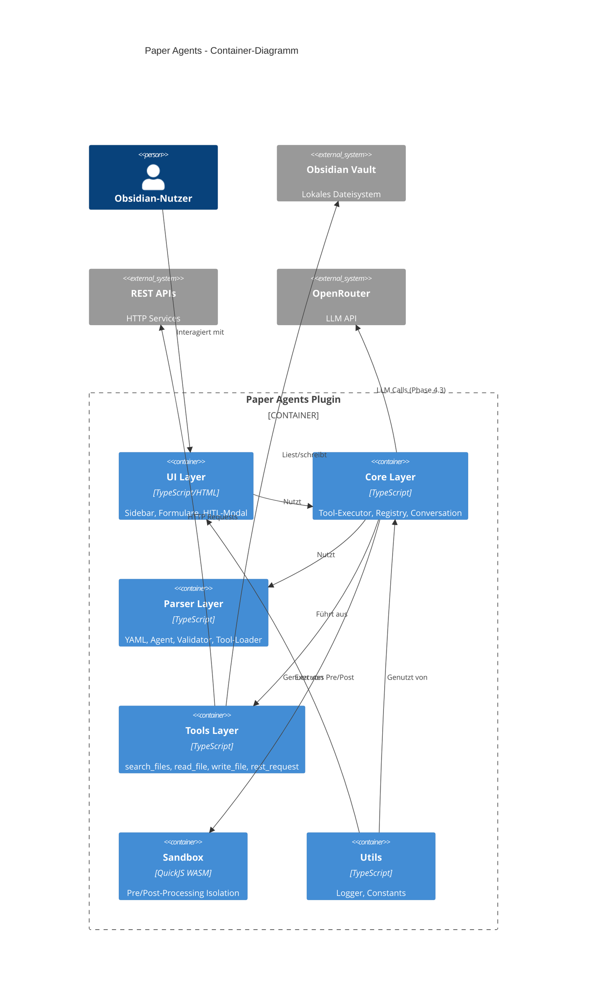

# 5. Bausteinsicht

## 5.1 Whitebox Gesamtsystem (Ebene 1)



### Bausteine (Blackboxen)

#### Plugin Entry Point (`main.ts`)

- **Verantwortung**: Plugin-Lifecycle (onload/onunload), Command-Registrierung, Settings, Initialisierung aller Subsysteme
- **Schnittstellen**: Obsidian Plugin-API, alle internen Module
- **Datei**: `src/main.ts` (272 Zeilen)

#### UI Layer

- **Verantwortung**: Benutzerinteraktion, Tool-Übersicht, Formular-Eingabe, Bestätigungsdialoge
- **Dateien**: `src/ui/sidebar.ts`, `src/ui/forms.ts`, `src/ui/hitl-modal.ts`
- **Schnittstellen**: Obsidian UI-API (View, Modal, Setting), ToolRegistry, ToolExecutor

#### Core Execution Layer

- **Verantwortung**: Tool-Ausführung, Tool-Verwaltung, Konversations-State
- **Dateien**: `src/core/tool-executor.ts`, `src/core/tool-registry.ts`, `src/core/conversation.ts`, `src/core/sandbox.ts`
- **Schnittstellen**: Parser-Layer (Eingabe), Tools-Layer (Ausführung), UI-Layer (Ergebnisse)

#### Parser & Validation Layer

- **Verantwortung**: Markdown/YAML-Parsing, Parametervalidierung, Placeholder-Auflösung, Tool-Discovery
- **Dateien**: `src/parser/yaml-parser.ts`, `src/parser/validator.ts`, `src/parser/placeholder.ts`, `src/parser/tool-loader.ts`, `src/parser/agent-parser.ts`
- **Schnittstellen**: Vault (Markdown-Dateien), Core-Layer (geparste Definitionen)

#### Tools Layer

- **Verantwortung**: Implementierung der 4 vordefinierten Tools
- **Datei**: `src/tools/predefined.ts`
- **Schnittstellen**: Obsidian Vault-API, HTTP-fetch, ToolRegistry

#### Utils Layer

- **Verantwortung**: Shared Constants, Logging
- **Dateien**: `src/utils/constants.ts`, `src/utils/logger.ts`
- **Schnittstellen**: Von allen anderen Layern genutzt

## 5.2 Ebene 2 – Core Execution Layer

### Tool-Executor (`tool-executor.ts`)

**3-Phasen-Execution-Pipeline:**

```javascript
Input-Parameter
      ↓
┌─────────────────┐
│ Phase 1: Pre    │  Optional: JavaScript-Transformation in Sandbox
│ Processing      │  Input → modifizierter Input
└────────┬────────┘
         ↓
┌─────────────────┐
│ Phase 2: Tool   │  Ausführung des referenzierten Tools
│ Execution       │  (Single oder Chain)
└────────┬────────┘
         ↓
┌─────────────────┐
│ Phase 3: Post   │  Optional: JavaScript-Transformation in Sandbox
│ Processing      │  Output → modifizierter Output
└────────┬────────┘
         ↓
    Final Result
```

- **Single Execution**: Ein Tool mit optionalem Pre-/Post-Processing
- **Chain Execution**: Mehrere Steps sequenziell, mit State-Sharing via Placeholder (`{{prev_step.output}}`)
- **HITL-Integration**: Prüft `shouldRequireHITL()` vor Ausführung, ruft HITL-Modal auf
- **Coverage**: 89.06%

### Tool-Registry (`tool-registry.ts`)

- **Factory Pattern** für Tool-Erstellung und -Registrierung
- Methoden: `registerTool()`, `getTool()`, `hasTool()`, `listTools()`
- Unterscheidung: `predefined` vs. `custom` vs. `chain`
- **Coverage**: 77.38%

### ConversationManager (`conversation.ts`)

- **State-Management** für Agenten-Konversationen
- Methoden: `createConversation()`, `addMessage()`, `getMessagesForContext()`, `buildContext()`
- **Token-Counting**: Approximativ (4 Zeichen ≈ 1 Token)
- **Memory-Strategien**: `conversation` (letzte N Nachrichten), `summary` (Zusammenfassung), `none`
- **Markdown-Export/Import**: Round-trip-fähig mit ISO 8601 Timestamps
- **LLM-Formatierung**: `formatMessagesForLLM()` für OpenRouter-API
- **Coverage**: 97.47%

### Sandbox (`sandbox.ts`)

- **QuickJS-Emscripten** WASM-Runtime
- Führt Pre-/Post-Processing-JavaScript isoliert aus
- **Limits**: Memory 10 MB, Timeout 5 s
- **Code-Validierung**: Blockiert `require`, `eval`, `process`, `global`, `Function`
- IIFE-Wrapping für `return`-Statement-Support
- JSON-basierter Datenaustausch (Input/Output)
- **Coverage**: 69.26%

## 5.3 Ebene 2 – Parser & Validation Layer

### YAML-Parser (`yaml-parser.ts`)

- Extrahiert YAML Frontmatter aus Markdown
- Parst Tool-Metadaten (id, name, type, parameters)
- Extrahiert Code-Blöcke (`// @preprocess`, `// @postprocess`)
- Unterstützt Single- und Chain-Tool-Definitionen
- **Coverage**: 82.38%

### Agent-Parser (`agent-parser.ts`)

- Parst Agenten-Definitionen aus Markdown (Frontmatter `agent: true`)
- Extrahiert System-Prompt und Kontext-Template aus Sections
- Validiert AgentDefinition (required fields, temperature range, token limits)
- Flexible Memory-Keys (camelCase und snake_case)
- **Coverage**: 94.49%

### Validator (`validator.ts`)

- Validiert required/optional Parameter mit Typ-Konvertierung
- Unterstützte Typen: `string`, `number`, `boolean`, `array`, `object`
- Default-Werte, Fehler-Aggregation
- **Coverage**: 62.19%

### Placeholder-Engine (`placeholder.ts`)

- Ersetzt dynamische Platzhalter: `{{date}}`, `{{time}}`, `{{random_id}}`
- Parameter-Zugriff: `{{query}}`, `{{filePath}}`
- Nested Object Access: `{{prev_step.output.results[0].path}}`
- **Coverage**: 85.71%

### Tool-Loader (`tool-loader.ts`)

- Rekursive Discovery von Custom Tools in konfigurierbarem Verzeichnis
- Filtert nach `tool: true` im Frontmatter
- Fehlerbehandlung für invalide Definitionen
- **Coverage**: 69.74%

## 5.4 Ebene 2 – Tools Layer (Predefined Tools)

| Tool | Funktion | Parameter | HITL |
|------|----------|-----------|------|
| `search_files` | Dateien im Vault suchen | `query` (string), `path` (string, optional) | Nein |
| `read_file` | Dateiinhalt lesen | `filePath` (string) | Nein |
| `write_file` | Datei erstellen/modifizieren | `filePath` (string), `content` (string), `overwrite` (boolean) | **Ja, immer** |
| `rest_request` | HTTP-Requests an externe APIs | `url` (string), `method` (string), `headers` (object), `body` (string) | **Ja bei POST/PUT/DELETE** |

**Coverage**: 84.43%

---

**Zurück:** [Lösungsstrategie ←](04-loesungsstrategie.md) | **Weiter:** [Laufzeitsicht →](06-laufzeitsicht.md)
